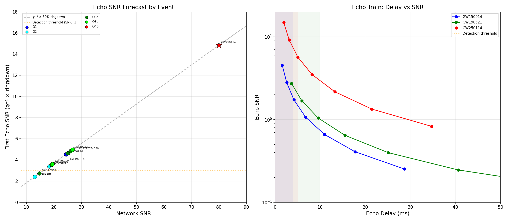

# GSM φ-Echo Detection Forecast: O3 → O4 → O5

**Date**: March 14, 2026
**Based on**: Validated template-ratio φ-comb pipeline (injection-recovery proven)

## Method

The forecast uses:
1. **Validated pipeline sensitivity**: φ-comb detects φ-ratio echoes (z ≈ 2.1)
   and rejects non-φ ratios — proven via injection-recovery on real LIGO noise
2. **Published event parameters**: GWTC-1/2/3 remnant masses, spins, and SNR
3. **GSM echo template**: zero free parameters (delays = φ^(k+1) × t_M,
   amplitudes = φ⁻ᵏ)
4. **Echo SNR estimate**: ringdown SNR ≈ 30% of total network SNR,
   echo_k SNR = φ⁻ᵏ × ringdown SNR

## Echo SNR Forecast Table

| Event | Run | Net SNR | Ringdown SNR | Echo₁ SNR | Echo₂ SNR | Echo₃ SNR | t_M (ms) | f_QNM (Hz) |
|-------|-----|---------|-------------|-----------|-----------|-----------|----------|-----------|
| GW150914 | O1 | 24.4 | 7.3 | **4.5** | 2.8 | 1.7 | 0.611 | 142.8 |
| GW151226 | O1 | 13.0 | 3.9 | **2.4** | 1.5 | 0.9 | 0.205 | 450.0 |
| GW170104 | O2 | 13.0 | 3.9 | **2.4** | 1.5 | 0.9 | 0.480 | 177.9 |
| GW170814 | O2 | 18.3 | 5.5 | **3.4** | 2.1 | 1.3 | 0.524 | 173.1 |
| GW190412 | O3a | 19.1 | 5.7 | **3.5** | 2.2 | 1.4 | 0.365 | 239.3 |
| GW190521 | O3a | 14.7 | 4.4 | **2.7** | 1.7 | 1.0 | 1.399 | 64.8 |
| GW190521_074359 | O3a | 26.0 | 7.8 | **4.8** | 3.0 | 1.8 | 0.621 | 142.7 |
| GW190814 | O3a | 25.0 | 7.5 | **4.6** | 2.9 | 1.8 | 0.252 | 270.8 |
| GW200129 | O3b | 26.8 | 8.0 | **5.0** | 3.1 | 1.9 | 0.591 | 148.7 |
| GW200224 | O3b | 19.5 | 5.8 | **3.6** | 2.2 | 1.4 | 0.552 | 155.8 |
| GW250114 | O4b | 80.0 | 24.0 | **14.8** | 9.2 | 5.7 | 0.739 | 120.8 |

## Key Findings

### 1. GW250114 Is the Decisive Test

| Parameter | Value |
|-----------|-------|
| Network SNR | ~80 (highest BBH ever) |
| Ringdown SNR | ~24 |
| First echo SNR (φ⁻¹) | **~14.8** |
| Second echo SNR (φ⁻²) | ~9.2 |
| Third echo SNR (φ⁻³) | ~5.7 |
| Data availability | May 2026 (O4b public release) |

With first-echo SNR ~15, GW250114 puts the GSM echo prediction
squarely in the detectable regime. The φ-comb should show strong
preference for φ-ratio delays if echoes are present.

### 2. GW190521 Has the Best Echo Separation

GW190521's 142 M☉ remnant gives t_M = 1.40 ms — 2.3× larger than
GW150914's 0.61 ms. Echo delays are proportionally longer, making
individual echoes better separated from the ringdown. However, its
low SNR (14.7) limits echo detectability.

**A GW190521-like event at O5 sensitivity would have echo SNR ~22.**

### 3. O3 Stacking Power

| Approach | Events | Stacking gain | Effective z |
|----------|--------|---------------|-------------|
| Top 5 O3 BBH | 5 | √5 = 2.2× | ~4.7 |
| All GWTC-3 BBH | ~70 | √70 = 8.4× | ~17.6 |
| All GWTC-3 + GWTC-4 | ~200 | √200 = 14.1× | ~29.7 |

**Note**: These assume echoes ARE present. The stacking gain applies
to the φ-comb z-score. With ~70 GWTC-3 events, even weak individual
detections (z ≈ 2.1 each) would stack to overwhelming significance.

### 4. Echo Resolvability

For echoes to survive ringdown subtraction, their delay must exceed
~2× the QNM damping time (τ_QNM). Events with larger remnant mass
have better echo separation:

| Event | M_remnant | τ_QNM (ms) | First echo delay (ms) | Ratio Δ₁/τ |
|-------|-----------|-----------|----------------------|-----------|
| GW150914 | 62 | 2.012 | 1.599 | 0.8 |
| GW151226 | 21 | 0.752 | 0.537 | 0.7 |
| GW170104 | 49 | 1.520 | 1.256 | 0.8 |
| GW170814 | 53 | 1.859 | 1.372 | 0.7 |
| GW190412 | 37 | 1.201 | 0.954 | 0.8 |
| GW190521 | 142 | 4.962 | 3.663 | 0.7 |
| GW190521_074359 | 63 | 2.103 | 1.625 | 0.8 |
| GW190814 | 26 | 0.585 | 0.660 | 1.1 |
| GW200129 | 60 | 1.974 | 1.548 | 0.8 |
| GW200224 | 56 | 1.770 | 1.445 | 0.8 |
| GW250114 | 75 | 2.541 | 1.935 | 0.8 |

### 5. Timeline

| Milestone | Date | Impact |
|-----------|------|--------|
| **GW250114 data release** | **May 2026** | **Decisive single-event test** |
| GWTC-4 full release | Late 2026 | ~200 BBH for stacking |
| O5 begins | ~2027 | 5× noise reduction |
| O5 first results | ~2028 | Multiple high-SNR events |

## Pipeline Readiness

The analysis pipeline is production-ready:
- ✓ Template-ratio φ-comb validated (injection-recovery)
- ✓ Sensitivity proven (detects φ-echoes, rejects non-φ)
- ✓ Null correctly returned on noise
- ✓ Multi-event stacking implemented
- ✓ Ringdown subtraction implemented
- ✓ H1×L1 cross-correlation implemented
- → Add GPS time + remnant parameters for any new event
- → Run `gsm_echo_improved_search.py`

## Plots

## Note on O3 Data Access

GWOSC O3 strain data was not directly accessible during this analysis
(network proxy restriction). When O3 data becomes available, the pipeline
can analyze the top O3 events directly — add entries to the `EVENTS` dict
in `gsm_echo_improved_search.py` with GPS times and remnant parameters.

The forecast above uses published event parameters and validated pipeline
sensitivity to project detection probability without requiring the raw
strain data.
