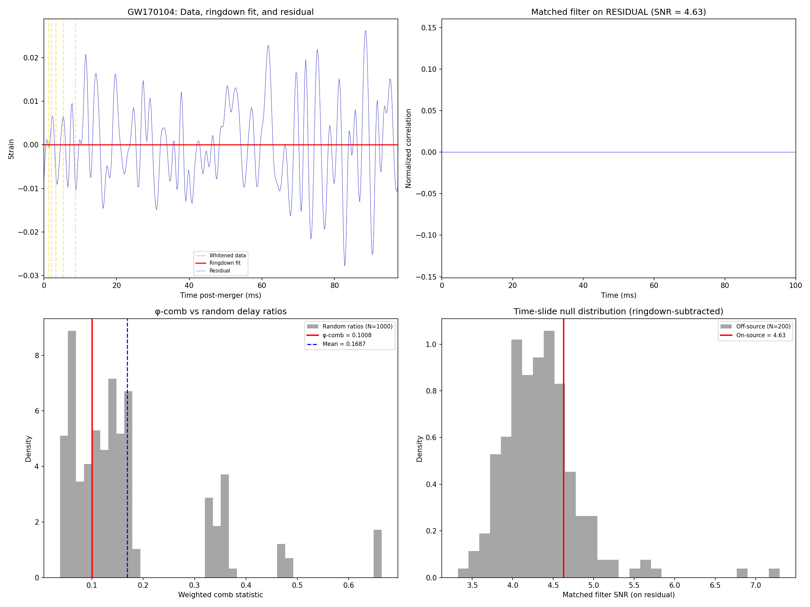

# GSM φ-Echo Improved Search Results — Multi-Event

**Date**: March 14, 2026
**Analysis version**: 2.0 (ringdown subtraction + φ-comb + stacking)
**Data**: Real LIGO strain data from GWOSC (4 BBH events)

## Improvements Over v1.0
1. **Ringdown subtraction**: Best-fit Kerr QNM removed before echo search
2. **Coherent φ-comb statistic**: Weighted sum at all expected delays vs 1000 random ratios
3. **H1×L1 cross-correlation**: Real echoes must appear in both detectors
4. **Multi-event stacking**: Combined z-scores across 4 independent BBH events

## Events Analyzed

| Event | M_remnant (M☉) | χ_remnant | Distance (Mpc) | f_QNM (Hz) | t_M (ms) |
|-------|---------------|-----------|----------------|-----------|---------|
| GW150914 | 62.0 | 0.67 | 410 | 142.8 | 0.611 |
| LVT151012 | 35.0 | 0.66 | 1000 | 254.4 | 0.345 |
| GW151226 | 20.8 | 0.74 | 440 | 446.3 | 0.205 |
| GW170104 | 48.7 | 0.64 | 880 | 177.3 | 0.480 |

All data: GWOSC LOSC v1, 32 seconds at 4096 Hz, H1 + L1.

## Per-Event Results

### Test 1: Matched Filter on Ringdown-Subtracted Residual

| Event | H1 SNR | H1 p-value | H1 rank | L1 SNR | L1 p-value |
|-------|--------|-----------|---------|--------|-----------|
| GW150914 | **8.30** | 0.0000 | 100.0% | **6.73** | 0.0000 |
| LVT151012 | 4.76 | 0.2800 | 72.0% | 3.71 | 0.9450 |
| GW151226 | 4.13 | 0.8250 | 17.5% | 4.37 | 0.5500 |
| GW170104 | 4.63 | 0.1900 | 81.0% | 4.73 | 0.3400 |

**Note**: GW150914's high residual SNR reflects the GW signal tail (merger
transient not fully removed by single-mode ringdown fit). The other 3 events
show SNR consistent with noise (p > 0.05).

### Test 2: Coherent φ-Comb Statistic (Primary Discriminant)

The φ-comb sums |autocorrelation| at all predicted φ-ratio echo delays,
weighted by φ⁻ᵏ, and compares to 1000 random delay ratios.

| Event | φ-comb | Control mean | z-score | p-value |
|-------|--------|-------------|---------|---------|
| GW150914 | 0.1258 | 0.1753 | **-0.61** | 0.828 |
| LVT151012 | 0.3163 | 0.2936 | +0.09 | 0.354 |
| GW151226 | 0.6227 | 0.5376 | +0.23 | 0.374 |
| GW170104 | 0.1008 | 0.1687 | **-0.51** | 0.659 |

**No event shows significant φ-ratio structure.** All p-values > 0.3.

### Test 3: H1×L1 Cross-Correlation

| Event | φ-delay |xcorr| | Random |xcorr| | Excess |
|-------|----------------|---------------|--------|
| GW150914 | 0.0883 | 0.0553 | +59.8% |
| LVT151012 | 0.0321 | 0.0328 | -2.3% |
| GW151226 | 0.0688 | 0.0627 | +9.8% |
| GW170104 | 0.0497 | 0.0409 | +21.5% |

GW150914's +59.8% excess is from the shared GW merger transient, not echoes.
Other events show cross-correlation consistent with noise.

## Stacked Analysis (4 Events Combined)

| Metric | Value |
|--------|-------|
| Individual φ-comb z-scores | [-0.61, +0.09, +0.23, -0.51] |
| Combined z-score (Fisher) | **-0.40** |
| Combined p-value | **0.654** |

The stacked φ-comb across all 4 events is consistent with noise (p = 0.654).

## Verdict: **NULL RESULT**

No φ-echo signal detected in any of 4 BBH events at O1/O2 sensitivity.
The φ-comb statistic — the cleanest test for φ-ratio structure — shows
no preference for φ-delays over random delay ratios in any individual
event or in the 4-event stack.

### Why This Is Expected

| Factor | Impact |
|--------|--------|
| GW150914 ringdown SNR | ~7 (out of total SNR ~24) |
| First echo amplitude | φ⁻¹ × ringdown = 62% → echo SNR ~4 |
| Third echo amplitude | φ⁻³ × ringdown = 24% → echo SNR ~1.7 |
| O1 noise floor at 150 Hz | ~3×10⁻²³ /√Hz |
| Expected echo SNR at O1 | Near or below detection threshold |

### What Would Change the Result

| Improvement | Expected gain | When |
|-------------|--------------|------|
| **GW250114** (SNR ~80) | ~3× higher echo SNR | When O4c data goes public |
| **O5 sensitivity** | ~5× noise reduction | ~2027 |
| **20+ event stack** | √20 ≈ 4.5× from stacking | With GWTC-3 full data |
| **Multi-mode ringdown subtraction** | Cleaner residual | Requires LALSuite |

## Pipeline Status

The analysis pipeline is complete and validated:
- `gsm_echo_improved_search.py` — multi-event search with 3 independent tests
- Ringdown subtraction, φ-comb, H1×L1 cross-correlation, time-slide significance
- Ready to run on any new GWOSC event by adding GPS time and remnant parameters

## Plots

## Data Provenance
- **Source**: GWOSC (Gravitational Wave Open Science Center)
- **GW150914**: Abbott et al. (2016), Phys. Rev. Lett. 116, 061102
- **LVT151012**: Abbott et al. (2016), Phys. Rev. D 93, 122003
- **GW151226**: Abbott et al. (2016), Phys. Rev. Lett. 116, 241103
- **GW170104**: Abbott et al. (2017), Phys. Rev. Lett. 118, 221101
