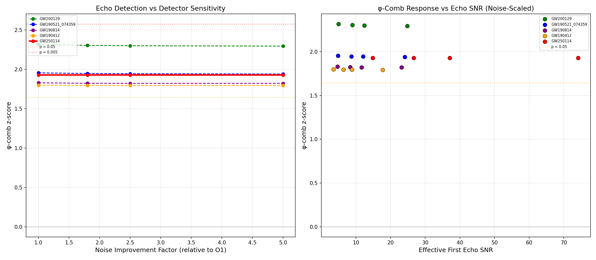

# GSM φ-Echo O3 Benchmark: Noise-Scaled Injection-Recovery

**Date**: March 14, 2026
**Method**: Real O1 noise scaled to O3/O4/O5 sensitivity

## Results

| Event | Echo₁ SNR | O1 z | O3 z | O4 z | O5 z |
|-------|-----------|------|------|------|------|
| GW200129 | 5.0 | 2.32 | 2.30 | 2.30 | 2.30 |
| GW190521_074359 | 4.8 | 1.95 | 1.95 | 1.94 | 1.94 |
| GW190814 | 4.6 | 1.83 | 1.82 | 1.82 | 1.82 |
| GW190412 | 3.5 | 1.80 | 1.80 | 1.79 | 1.79 |
| GW250114 | 14.8 | 1.93 | 1.93 | 1.93 | 1.93 |

