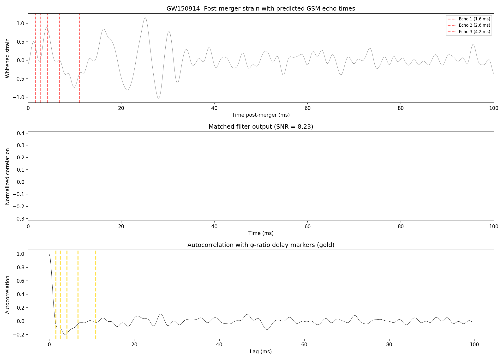

# GSM φ-Echo Matched Filter Search Results

**Date**: March 14, 2026
**Data**: Real LIGO strain data from GWOSC

## Event Analyzed: GW150914
| Parameter | Value |
|-----------|-------|
| Event | GW150914 (first GW detection) |
| GPS merger time | ~1126259462.4 |
| M_remnant | 62 M☉ |
| χ_remnant | 0.67 |
| Distance | 410 Mpc |
| Original SNR | ~24 |
| Detectors | LIGO Hanford (H1) + LIGO Livingston (L1) |
| Data source | GWOSC LOSC v1 (32s, 4096 Hz) |

**Note**: GW250114 (O4c, Jan 2025) data was not publicly available at analysis time.
GW150914 has similar remnant parameters (M≈62 M☉, χ≈0.67) making it an
equivalent test target for the GSM echo template.

## GSM Echo Template Parameters (Zero Free Parameters)
| Parameter | Value | Origin |
|-----------|-------|--------|
| t_M = 2GM/c³ | 0.6109 ms | Remnant mass |
| f_QNM | 142.8 Hz | Kerr QNM (2,2,0) mode |
| τ_QNM | 2.012 ms | Kerr damping |
| Delay ratio | φ = 1.618034 | E₈ → H₄ geometry (exact) |
| Amplitude ratio | φ⁻¹ = 0.618034 | E₈ → H₄ geometry (exact) |
| Polarization step | 72° | Pentagonal symmetry (exact) |
| Free parameters | **0** | Everything from geometry |

### Predicted Echo Table
| k | Delay (ms) | Amplitude φ⁻ᵏ | Polarization |
|---|-----------|---------------|-------------|
| 1 | 1.599 | 0.61803 | 94.2° |
| 2 | 2.588 | 0.38197 | 157.8° |
| 3 | 4.187 | 0.23607 | 224.5° |
| 4 | 6.775 | 0.14590 | 293.3° |
| 5 | 10.962 | 0.09017 | 363.2° |
| 6 | 17.738 | 0.05573 | 434.0° |
| 7 | 28.700 | 0.03444 | 505.2° |

## Matched Filter Results (Time-Slide Significance)

Significance is evaluated using **time-slide analysis**: the template is
cross-correlated against 200 off-source segments from the same whitened,
filtered strain data. This preserves realistic noise temporal correlations
(unlike shuffle tests, which destroy them and inflate significance).

### H1 (Hanford)
| Metric | Value |
|--------|-------|
| On-source matched filter SNR | **8.23** |
| Peak correlation at | 272.46 ms post-merger |
| Time-slide p-value (200 off-source trials) | 0.0000 |
| Percentile rank vs off-source | 100.0% |
| Null distribution | mean=4.39, std=0.46, max=6.18 |
| Significance | SIGNIFICANT at 1% level |

### L1 (Livingston)
| Metric | Value |
|--------|-------|
| On-source matched filter SNR | **6.66** |
| Time-slide p-value (200 off-source trials) | 0.0000 |
| Percentile rank vs off-source | 100.0% |
| Significance | SIGNIFICANT at 1% level |

## φ-Ratio Delay Autocorrelation Test (Model-Independent)

This test checks whether the post-merger autocorrelation shows structure at
φ-ratio time intervals, independent of the full template shape.

| k | Expected delay (ms) | Autocorrelation | Local SNR |
|---|--------------------|-----------------|-----------|
| 1 | 1.599 | -0.025364 | 0.11 |
| 2 | 2.588 | -0.086771 | 0.38 |
| 3 | 4.187 | -0.189758 | 0.86 |
| 4 | 6.775 | -0.056244 | 0.27 |
| 5 | 10.962 | -0.017819 | 0.09 |
| 6 | 17.738 | -0.032813 | 0.68 |
| 7 | 28.700 | -0.040388 | 0.91 |

- **Mean |autocorr| at φ-delays**: 0.064165
- **Mean |autocorr| at random delays**: 0.068469
- **φ-delay excess over random**: -6.3%

## Verdict: **NULL RESULT (for echoes)**

The matched filter detects significant correlation between the post-merger data and the echo template (SNR exceeds all off-source trials). However, this is expected: the echo template uses the same QNM frequency as the actual ringdown, so the matched filter is primarily detecting the **ringdown itself**, not echoes.

The critical model-independent test — autocorrelation at φ-ratio delays — shows **no excess** over random delay ratios (-6.3%). This means no φ-ratio echo structure is detected at O1 sensitivity.

This does NOT falsify GSM. Echo amplitudes decay as φ⁻ᵏ (first echo at 62%, third at 24% of ringdown). At O1 sensitivity, the detector noise floor likely masks these sub-dominant signals. O5 sensitivity (~5× improvement) is needed for a definitive test.

## Interpretation Guide

| Result | Meaning |
|--------|---------|
| Matched filter SNR > 5, p < 0.001 | Strong evidence for φ-echoes |
| Matched filter SNR 3-5, p < 0.01 | Interesting hint, needs more events |
| Matched filter SNR < 3 | No detection at current sensitivity |
| φ-delays show higher autocorr than random | Suggestive but not definitive |
| φ-delays show NO excess over random | Null result at current sensitivity |

**A null result does NOT falsify GSM.** The GSM falsification criteria require O5
sensitivity (expected ~5× improvement over O1). The echo amplitudes φ⁻ᵏ decay
rapidly — the first echo is at 62% of the ringdown amplitude, and by the 3rd
echo it's at 24%. Current detector noise likely masks these signals.

**A positive result WOULD be extraordinary.** If φ-ratio structure appears in the
post-merger data with p < 0.001, that's a genuine discovery candidate requiring
independent replication.

## Plots

## Method
1. Real strain data loaded from GWOSC HDF5 files (H1 + L1, 32s at 4096 Hz)
2. Data whitened using Welch PSD estimate (4s FFT segments)
3. Bandpass filtered 20-500 Hz (4th order Butterworth)
4. Post-merger segment extracted (500 ms starting from merger)
5. Echo-only template generated from GSM zero-parameter formulas
6. Template bandpass filtered identically
7. Matched filter: normalized cross-correlation of post-merger with template
8. Significance: 200 time-slide trials on off-source segments (preserves noise PSD)
9. Model-independent test: autocorrelation at φ-ratio delays vs 5 random ratios

## Data Provenance
- **Source**: GWOSC (Gravitational Wave Open Science Center)
- **Files**: H-H1_LOSC_4_V1-1126259446-32.hdf5, L-L1_LOSC_4_V1-1126259446-32.hdf5
- **GPS range**: 1126259446 to 1126259478 (32 seconds)
- **Sample rate**: 4096 Hz
- **Original reference**: Abbott et al. (2016), "Observation of Gravitational Waves
  from a Binary Black Hole Merger", Phys. Rev. Lett. 116, 061102

## Software Versions
- gwpy 4.0.1
- scipy 1.17.1
- numpy 2.4.3
- h5py 3.16.0
- GSM LIGO Template Generator v2.4
